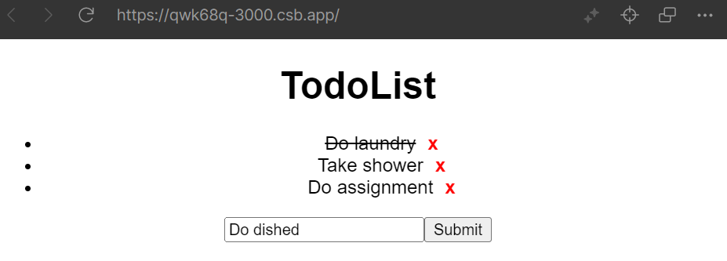

# ReactStudy
Created with CodeSandbox

<!-- ABOUT THE PROJECT -->
## About The Project

  

This website is a simple exercise I made based on the React tutorial from [FreeCodeCamp]([https://www.freecodecamp.org/news/how-to-build-a-web-app-with-go-gin-and-react-cffdc473576/](https://www.freecodecamp.org/news/react-tutorial-build-a-project/)). 

The website is a todo list where users can add, check off, or delete todo items. You can see a demo of the website [here](https://qwk68q-3000.csb.app/). I have also made some reasonable modifications to the code in the tutorial.

### Built With
* [![React][React.js]][React-url]

<!-- MARKDOWN LINKS & IMAGES -->
[React.js]: https://img.shields.io/badge/React-20232A?style=for-the-badge&logo=react&logoColor=61DAFB
[React-url]: https://reactjs.org/
